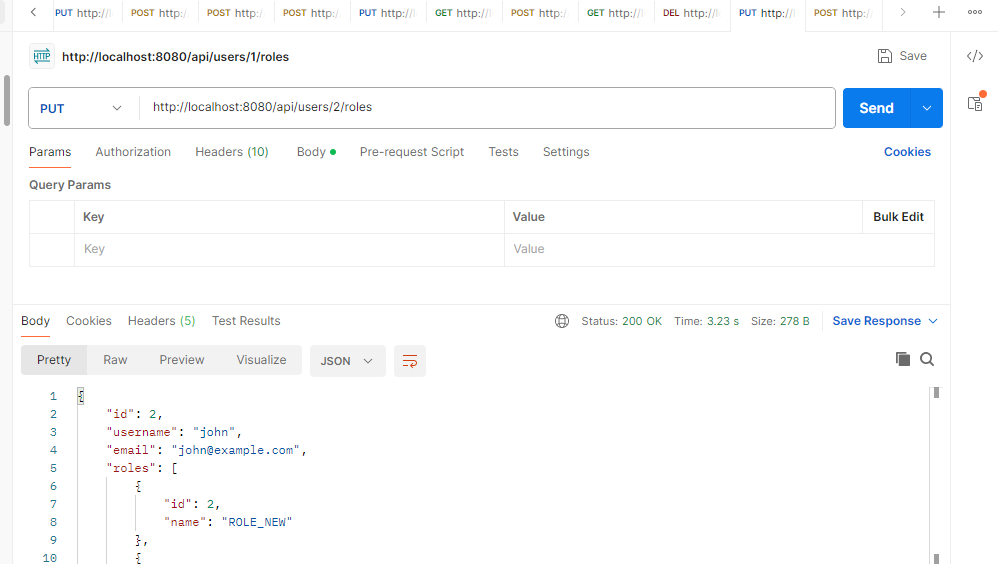
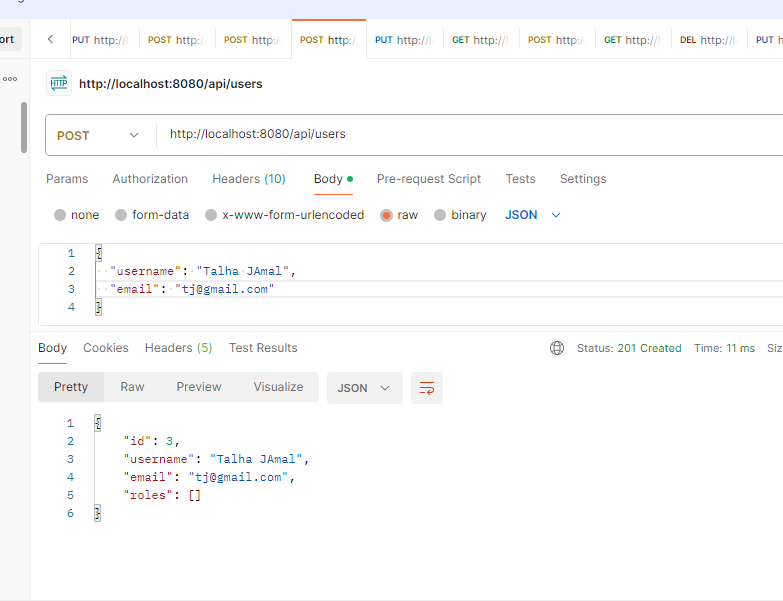
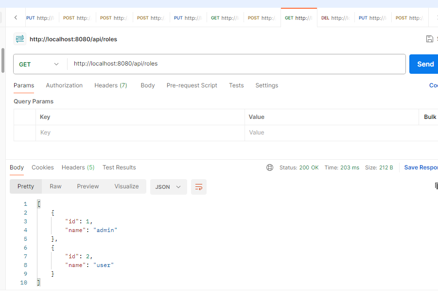
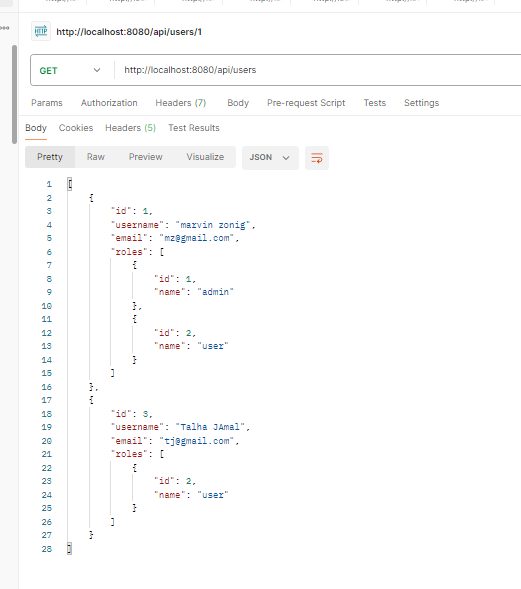
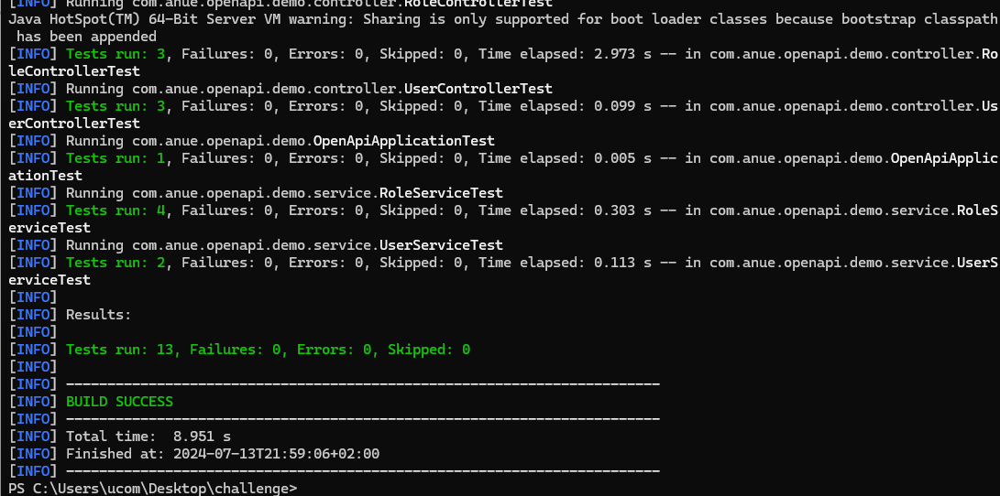
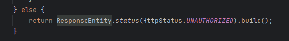
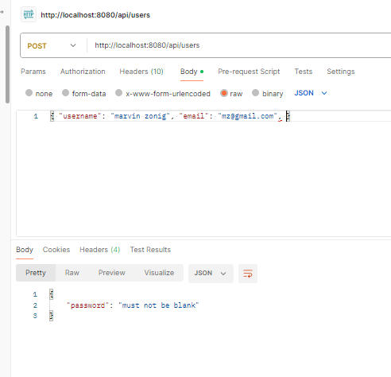

# User Management System - Backend Coding Challenge

## Task

Your task is to implement a Spring Boot application that fulfills the provided OpenAPI specification for a User Management system. The specification includes CRUD operations for managing users and roles, as well as an optional authentication endpoint.

## Requirements

1. Implement a RESTful API according to the provided OpenAPI specification.
2. Use Spring Boot for the backend.
3. Use an in-memory database (like H2) or any other of your choice to persist users and roles.
4. Handle data validation and error handling appropriately.
5. The application should be able to run locally.
6. (Optional) Implement an authentication mechanism. You can choose any method you prefer (e.g., JWT, OAuth, Basic Auth).

## Acceptance Criteria

1. The application should start without any errors.
2. The application should provide endpoints for creating, reading, updating, and deleting users and roles.
3. The application should validate incoming data before processing it.
4. The application should handle errors gracefully and return appropriate HTTP status codes and messages.
5. The application should include unit tests to verify the functionality of the service.
6. It should be possible to run the application locally. Instructions for how to do this should be included in the README.
7. (Optional) The application should provide an authentication mechanism.

## Submission

Please submit your completed challenge as a zip file or provide a link to the repository containing your solution.

## Running the Application Locally

Please include detailed instructions on how to run your application locally. This should include steps to build the application, start the application, and any other necessary steps.

Good luck!
# Solution
## Prerequisites
#### 1. Intall Java 17
#### 2. Maven Install 

## Task Implemented Successfully

1. The application should start without any errors. Yes
2. The application should provide endpoints for creating, reading, updating, and deleting users and roles. Yes
3. The application should validate incoming data before processing it. Yes
4. The application should handle errors gracefully and return appropriate HTTP status codes and messages. Yes
5. The application should include unit tests to verify the functionality of the service. Yes
6. It should be possible to run the application locally. Instructions for how to do this should be included in the README. Yes
7. (Optional) The application should provide an authentication mechanism. Yes

# Commands to start
#### mvn clean install (to install all dependencies)
#### mvn spring-boot:run (to start app)
#### mvn test (to run unit tests )
#### mvn package (to publish Jar file)

# Curls for testing :
## Login
curl -X POST http://localhost:8080/api/users/login \
-H "Content-Type: application/json" \
-d '{
"username": "talha",
"password": "1234"
}'

## Create user
curl -X POST http://localhost:8080/api/users \
-H "Content-Type: application/json" \
-H "Authorization: 1kPIVEbgCryJTIk/I4ISXF1M1v3WROuB30JSz5YqBFM=" \
-d '{
"username": "marvin zonig",
"email": "mz@gmail.com"
}'
## Update user
curl -X PUT http://localhost:8080/api/users/1 \
-H "Content-Type: application/json" \
-H "Authorization: 1kPIVEbgCryJTIk/I4ISXF1M1v3WROuB30JSz5YqBFM=" \
-d '{
"username": "marvin zonig updated ",
"email": "mz_updated@gmail.com"}'

## Get user by id
curl -X GET http://localhost:8080/api/users/1 \
-H "Authorization: 1kPIVEbgCryJTIk/I4ISXF1M1v3WROuB30JSz5YqBFM="

## Get all users
curl -X GET http://localhost:8080/api/users \
-H "Authorization: 1kPIVEbgCryJTIk/I4ISXF1M1v3WROuB30JSz5YqBFM="

## Deleting user by id
curl -X DELETE http://localhost:8080/api/users/1 \
-H "Authorization: 1kPIVEbgCryJTIk/I4ISXF1M1v3WROuB30JSz5YqBFM="

## Create role
curl -X POST http://localhost:8080/api/roles \
-H "Content-Type: application/json" \
-H "Authorization: 1kPIVEbgCryJTIk/I4ISXF1M1v3WROuB30JSz5YqBFM=" \
-d '{
"name": "admin"
}'
## Get all roles
curl -X GET http://localhost:8080/api/roles \
-H "Authorization: 1kPIVEbgCryJTIk/I4ISXF1M1v3WROuB30JSz5YqBFM="

## Assigning a role to a user
curl -X PUT http://localhost:8080/api/users/1/roles \
-H "Content-Type: application/json" \
-H "Authorization: 1kPIVEbgCryJTIk/I4ISXF1M1v3WROuB30JSz5YqBFM=" \
-d '[1]'

####  return appropriate HTTP status codes

#### Validation
